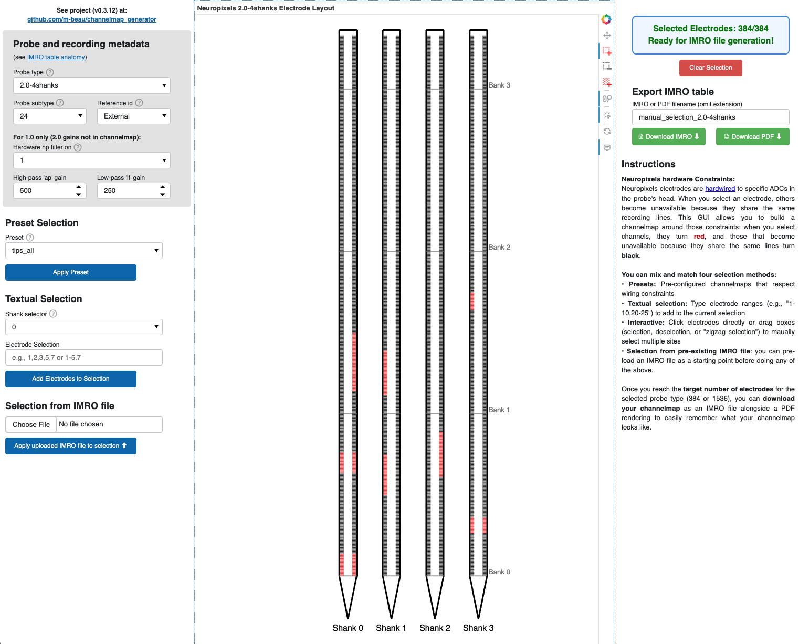

# Channelmap Generator for Neuropixels Probes

⚡ Generate channel maps for Neuropixels probes that respect electrode-ADC wiring constraints! ⚡

<div align="center"> <a href="https://neuropixels-channelmap-generator.pni.princeton.edu">>>> Online GUI <<<</a> </div><br>

Purpose of this tool:
- Convenient (fully browser-based) generation of "IMRO tables" (i.e. channelmaps + reference, + amplification gain for 1.0 probes) at your desk, without having to download, install SpikeGLX and plug-in a probe
- Arbitrary selection of electrode geometries, within the boundaries of the electrode-ADC wiring constraints
- Common presets available out of the box (reach out to suggest other common geometries!)
- Simple pre-existing IMRO table loading (which is convenient to remember the probe geometry of a specific file, and allows you to use pre-existing files as a starting point to build a new channelmap)


**Disclaimer**: this tool is in <u>beta</u> release and should be considered a work in progress, deployed early to gather feedback. The imro editor tools in SpikeGLX and Open Ephys work correctly. What we are providing here are tools to specify imro tables more easily and conveniently. However, it will take some time to debug all the issues in this beta. If you import one of our tables into SpikeGLX or Open Ephys, please be sure to double check that all the site selections, referencing, gains, and filter settings that get imported are what you intended.

**Note on SpikeGLX loading of custom IMRO tables**: When loading IMRO tables generated by this tool into SpikeGLX, the reference/gain editing options may appear greyed out. This is expected behavior for non-canonical IMRO tables. SpikeGLX greys out editing features for imported tables that don't match its canonical format (being whole/half-shank width boxes that enclose all AP channels with attributes for all channels). This allows SpikeGLX to use external tables "as is" without knowing how to modify them safely. If you need to make adjustments, use the [online gui](https://neuropixels-channelmap-generator.pni.princeton.edu) again: upload your .imro file as a starting point, then modify your .imro table before re-downlading it and re-importing into SpikeGLX.

## Local installation

Clone the repository and navigate to it:

```bash
git clone http://github.com/m-beau/channelmap_generator.git
cd channelmap_generator
```

### Install the package using pip

For example, in a new conda environment:

```bash
conda create -n my_environment python=3.12
conda activate my_environment
uv pip install . # fast! run pip install uv first.
# or traditionally with pip only:
pip install .
```

### Using `uv` (Recommended)

With `uv`, you can either install dependencies first and then run the application, or run it directly in one command:

Install dependencies, then run:

```bash
uv sync
uv run cmap_gui
```

Or run directly (installs dependencies automatically):

```bash
uv run cmap_gui  # This will automatically install dependencies if needed
```

The second approach is particularly convenient as `uv` will automatically create a virtual environment, install all dependencies from `pyproject.toml`, and run the GUI in a single command.

### Run using Docker (Installation-free)

Run the latest stable Docker image directly without any local installation. The application will be available at http://localhost:5008.

```bash
docker run --rm --name channelmap-app -p 5008:5008 --pull=always ghcr.io/m-beau/channelmap_generator:latest
```

#### Docker Compose

For a more robust deployment, use Docker Compose. See the included `docker-compose.yml` for configuration details:

## Usage

### 1. Browser-based GUI

Launch the interactive GUI from the repository directory using one of these methods:

**If you installed with pip:**

```bash
cmap_gui  # Alias for: python ./channelmap_generator/gui/gui.py
```

**If you're using uv (recommended):**

```bash
uv run cmap_gui  # Automatically manages dependencies and virtual environment
```

Neuropixels electrodes are [hardwired](https://www.neuropixels.org/support) to specific ADCs in the probe's head. When you select an electrode, others become unavailable because they share the same recording lines. This GUI allows you to build a channelmap around those constraints: when you select channels, they turn **red**, and those that become unavailable because they share the same lines turn **black**.

You can mix and match four selection methods:\
• **Presets:** Pre-configured channelmaps that respect wiring constraints\
• **Textual selection:** Type electrode ranges (e.g., "1-10,20-25") to add to the current selection\
• **Interactive:** Click electrodes directly or drag boxes (selection, deselection, or "zigzag selection") to manually select multiple sites\
• **Selection from pre-existing IMRO file:** you can pre-load an IMRO file as a starting point before doing any of the above.

Once you reach the **target number of electrodes** for the selected probe type (384 or 1536), you can **download your channelmap** as an IMRO file alongside a PDF rendering to easily remember what your channelmap looks like.

> [!TIP]
> **Online version**: This GUI is available online at https://neuropixels-channelmap-generator.pni.princeton.edu - you can use it directly in your browser without installing anything.



### 2. Python API / Jupyter Notebook

Check out the code in `generate_channel_maps.ipynb` to reproducibly create custom channel maps. The notebook provides examples for all supported probe types and presets.

Here's a MWE:

```python
import channelmap_generator as cmg

# Generate a channel map
imro_list = cmg.generate_imro_channelmap(
    probe_type="2.0-4shanks",
    layout_preset="tips_all",
    wiring_file="wiring_maps/2.0-4shanks_wiring.csv"
)

# Save to file
cmg.save_to_imro_file(imro_list, "my_channelmap.imro")
```

## Supported Neuropixels versions

- Neuropixels 1.0
- Neuropixels 2.0 1-shank and 4-shank
- Neuropixels NXT (experimental)

UHD currently not supported, reach out if you need it implemented.